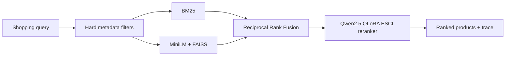

# Adaptive Product Search — Measured Retrieval Quality

This project studies a practical product-search question: can a transparent candidate retriever plus a supervised relevance reranker place acceptable products ahead of lexical near-matches, accessories, and irrelevant listings?

It is deliberately not a generic LLM/RAG demo. The value is in the baseline, the held-out evaluation, the failure behavior, and the trade-offs documented below.

## Architecture



Candidate generation supports three explicit modes:

- **BM25:** transparent lexical baseline.
- **Dense:** `sentence-transformers/all-MiniLM-L6-v2` embeddings in a local normalized-vector FAISS index.
- **Hybrid:** BM25 and dense rankings combined with Reciprocal Rank Fusion (`k=60`).

The default API mode is **hybrid + QLoRA reranking**. A requested dense index or remote adapter never silently falls back: it returns a structured `503` with a failure code. BM25 remains independently usable for baseline comparisons.

## Learned reranker

`Qwen/Qwen2.5-0.5B-Instruct` is fine-tuned with 4-bit QLoRA on Amazon Shopping Queries ESCI labels:

| Label | Meaning | Ranking gain |
| --- | --- | ---: |
| E | Exact product | 3 |
| S | Usable substitute | 2 |
| C | Complement/accessory | 1 |
| I | Irrelevant | 0 |

The frozen base weights remain unchanged; rank-16 LoRA matrices train on `q_proj`, `k_proj`, `v_proj`, and `o_proj`. The serving path ranks using the predicted ordinal label gain, not a fabricated constant confidence. Retrieval remains a small tie-breaking contribution, while explicit session feedback is reported separately and excluded from offline relevance metrics.

## Data and evaluation

The benchmark uses the US `small_version` of the [Amazon Shopping Queries ESCI dataset](https://github.com/amazon-science/esci-data). The official test split is isolated; train and validation rows are partitioned by `query_id` with a fixed seed.

- **Recall@K / MRR:** E and S are acceptable search outcomes.
- **NDCG@K:** graded gains E/S/C/I = 3/2/1/0.
- **Query-local ranking:** scored only on retrieved candidates with an observed ESCI judgment.
- **Global candidate coverage:** reports the same retrieval task across the catalog, with the limitation that unjudged products are treated as non-relevant.

The `scripts/run_search_experiments.py` runner records the exact config, sample size, index/model provenance, p50/p95 stage latency, metrics, and unavailable-system failures. It generates `comparison.md` automatically; no result table is manually maintained.

### Verified results

No official dense, hybrid, or adapter results are committed yet. The full ESCI catalog, FAISS index, and trained adapter artifacts are not present in this repository, so any improvement claim would be unverified. Generated artifacts are the source of truth:

- `reports/experiments/<run>/results.json`
- `reports/experiments/<run>/comparison.md`
- Colab `esci-comparison.json`, `esci-predictions.jsonl`, and `esci-training-metadata.json`

## Reproduce

Use Python 3.11+.

```bash
python -m pip install -e ".[dev,data,retrieval]"
python scripts/prepare_esci.py --dataset-dir /path/to/esci-data
python scripts/build_indexes.py --catalog data/processed/esci_products.json
python scripts/prepare_hard_negatives.py
python scripts/run_search_experiments.py --config configs/search_experiment.example.json
pytest
```

`prepare_hard_negatives.py` writes matched `baseline.jsonl` and `hard_negative.jsonl` training variants. It mines only known S/C/I ESCI examples that rank highly under hybrid retrieval—never unjudged products—and preserves the same label mix and sample size as the random/balanced baseline. Upload either variant with its manifest to Colab before training the matching ablation.

The experiment config compares:

1. BM25
2. Dense
3. Hybrid RRF
4. BM25 + QLoRA
5. Dense + QLoRA
6. Hybrid RRF + QLoRA

QLoRA systems remain marked unavailable until `FINETUNED_MODEL_URL` and its API key point to the trained Colab service. The notebook records training time and variant metadata alongside held-out classifier evidence.

## API

Start the existing FastAPI service with `uvicorn product_discovery.api:app --reload`. Search requests now accept optional controls while preserving the original simple request shape:

```json
{
  "message": "black university backpack",
  "strategy": "hybrid",
  "rerank": true,
  "candidate_k": 40
}
```

Responses contain candidate count, component scores, index/model versions, and per-stage latency. The frontend is intentionally unchanged; the API trace is the demo surface for retrieval comparisons.

## Failure modes and trade-offs

- Dense/hybrid retrieval requires a FAISS index whose catalog checksum matches the loaded catalog. A mismatch is an explicit error, not stale retrieval.
- QLoRA reranking depends on the authenticated Colab service. Colab + ngrok is suitable for a portfolio demo, not a production availability design; remote reranking latency is reported separately.
- ESCI has no user histories, prices, or complete relevance judgments. This project does not claim personalized recommendation quality, price-aware ranking, or production click-through impact.
- Recommendation, matrix factorization, two-tower models, learned personalization, and LTR are intentionally deferred. They require a genuine interaction dataset and a separate evaluation story rather than an unrelated feature bolted onto ESCI.

See [PORTFOLIO_CASE_STUDY.md](PORTFOLIO_CASE_STUDY.md) for the interview-oriented narrative and [PROJECT_EVIDENCE.md](PROJECT_EVIDENCE.md) for artifacts to retain.
