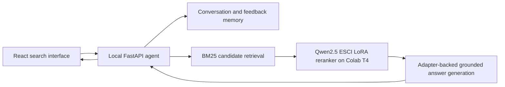

# Adaptive Product Search Agent - QLoRA Relevance Reranker

## Project summary

This project builds an end-to-end product-search system whose learned component is a fine-tuned relevance model rather than a rule-based demo. It fine-tunes `Qwen/Qwen2.5-0.5B-Instruct` on the official Amazon Shopping Queries ESCI dataset to classify query-product pairs as:

- **E - Exact:** directly satisfies the request.
- **S - Substitute:** a viable alternative.
- **C - Complement:** an accessory or related add-on.
- **I - Irrelevant:** does not satisfy the shopping intent.

The system combines transparent BM25 candidate retrieval with the learned ESCI reranker, conversation memory, feedback-aware ranking, and grounded answer generation. Training and GPU inference run in Google Colab; the local application provides the agent API and React interface.

## Why this is a legitimate fine-tuning project

The notebook does not merely load a pretrained model or prompt an API. It:

1. Downloads a real public relevance dataset maintained by Amazon Science.
2. Constructs query-level splits to prevent the same shopping query from leaking across training and validation.
3. Measures the frozen base model before training.
4. Learns new LoRA attention matrices from supervised ESCI labels.
5. Evaluates the adapter on the same held-out test examples used for the frozen baseline.
6. Saves prediction-level evidence, aggregate metrics, and the trained adapter.
7. Serves the fine-tuned adapter behind authenticated inference endpoints.

The evaluation values are generated by the notebook. No fine-tuned metric is hard-coded into the project.

## System architecture



BM25 acts as an interpretable candidate generator. The adapter provides the learned semantic relevance judgment used to rerank candidates. The answer endpoint receives only the ranked context and must cite product IDs from that context.

## Dataset and leakage controls

**Dataset:** Amazon Shopping Queries Dataset - ESCI, US locale, official small version.

The raw examples are joined with product metadata using `product_locale` and `product_id`. Model inputs include:

- Shopping query
- Product title
- Brand
- Colour
- Bullet points
- Product description

The notebook separates the official test split before any sampling. The remaining official training data is divided by unique `query_id`, so a query cannot appear in both training and validation.

The preprocessing cell constructs balanced working pools:

| Split | Examples | Construction |
|---|---:|---|
| Training pool | 24,000 | 6,000 per ESCI label |
| Validation pool | 2,000 | Query-separated and label-balanced |
| Official test pool | 1,000 | Official test split and label-balanced |
| Held-out comparison set | 500 | Fixed subset of the official test pool |

The current fast Colab experiment draws reproducible, seeded subsets of **10,000 training** and **500 validation** examples from those pools. The held-out comparison set remains separate and unchanged.

## Model and QLoRA configuration

**Base model:** `Qwen/Qwen2.5-0.5B-Instruct`

**Fine-tuning method:** supervised QLoRA using TRL `SFTTrainer`, PEFT, Transformers, Accelerate, and bitsandbytes.

| Setting | Value |
|---|---|
| Quantization | 4-bit NF4 with double quantization |
| Base computation | FP16 |
| LoRA rank | 16 |
| LoRA alpha | 32 |
| LoRA dropout | 0.05 |
| Target modules | `q_proj`, `k_proj`, `v_proj`, `o_proj` |
| Trainable parameters | 2,162,688 |
| Total parameters | 496,195,456 |
| Trainable proportion | 0.4359% |
| Training examples | 10,000 |
| Validation examples | 500 |
| Epochs | 1 |
| Batch size | 8 |
| Gradient accumulation | 2 |
| Effective batch size | 16 |
| Maximum sequence length | 256 tokens |
| Learning rate | 2e-4 |
| Scheduler | Cosine with 5% warmup |
| Optimizer | Paged AdamW 8-bit |
| Random seed | 42 |
| Hardware | Google Colab Tesla T4 |

Gradient checkpointing is disabled because the 0.5B quantized model fits on the T4 without it; this avoids recomputation overhead. AMP is disabled in the current runtime because its CUDA/PyTorch combination cannot unscale BF16 gradients. Trainable LoRA weights remain FP32, while the quantized base model computes in FP16.

## Supervised task format

Each example asks the model to judge the relationship between one query and one product. The target is constrained JSON:

```json
{"label":"E"}
```

Only `E`, `S`, `C`, or `I` is accepted. Deterministic decoding and schema parsing make the output usable by the ranking pipeline.

## Evaluation protocol

The notebook evaluates the frozen base model before constructing the LoRA trainer. After training, it evaluates the adapter on the exact same 500 held-out examples.

Primary metrics:

- Accuracy
- Macro-F1 across E/S/C/I
- Prediction-level base, adapter, and gold labels

Verified frozen-base result:

| Model | Accuracy | Macro-F1 |
|---|---:|---:|
| Frozen Qwen2.5-0.5B-Instruct | 0.2720 | 0.1338 |
| Fine-tuned QLoRA adapter | Pending current run | Pending current run |

The final values must be copied from `/content/esci-comparison.json` after Cell 4 completes. Do not replace the pending values with estimates.

## Notebook workflow

1. **Environment and data setup** - installs the ML and serving dependencies, clones Amazon Science's ESCI repository with Git LFS, and confirms a CUDA GPU.
2. **Data preparation** - joins query judgments with product metadata, creates leakage-safe query-level splits, and balances the four relevance labels.
3. **Frozen-base benchmark** - builds the classification prompt, performs deterministic inference, and records the untrained baseline.
4. **QLoRA fine-tuning** - loads a fresh 4-bit model, attaches rank-16 LoRA adapters, trains the adapter, evaluates it, and writes comparison evidence.
5. **Artifact persistence** - mounts Google Drive and copies the adapter, metrics, and prediction records to `MyDrive/adaptive-product-search/`.
6. **Secure serving setup** - reads `NGROK_AUTHTOKEN` and `MODEL_API_KEY` from Colab Secrets.
7. **Inference service** - exposes authenticated `/health`, `/parse-intent`, `/rerank`, and `/answer` FastAPI endpoints through ngrok.

## Generated artifacts

| Artifact | Purpose |
|---|---|
| `/content/esci-qwen-lora/` | Learned LoRA matrices, adapter configuration, and tokenizer files |
| `/content/esci-comparison.json` | Frozen-base and adapter metrics plus deltas |
| `/content/esci-predictions.jsonl` | Example-level gold, base, and fine-tuned predictions |
| `/content/esci-fast-checkpoints/` | Training checkpoint output |
| `MyDrive/adaptive-product-search/` | Persistent copies that survive Colab shutdown |

The adapter directory is the fine-tuned model artifact. It is intentionally much smaller than a full model because the frozen Qwen weights are not duplicated.

## Demonstration procedure

1. Select a T4 GPU in Colab and run Cells 1-4.
2. Confirm that Cell 4 prints the final `frozen_base`, `fine_tuned_lora`, and `delta` values.
3. Run Cell 5, authorize Google Drive, and verify that the adapter and evidence files were copied.
4. Add `NGROK_AUTHTOKEN` and a private random `MODEL_API_KEY` under Colab Secrets.
5. Run Cell 7 and copy the printed `FINETUNED_MODEL_URL`.
6. Put that URL and the same model API key in the local `.env` file.
7. Start the local FastAPI service and React frontend.
8. Confirm that the UI reports `LoRA online`, submit a shopping query, and show the retrieved candidates, ESCI reranking, and grounded response.

Keep the Colab runtime and serving cell active during the web demonstration.

## Resume entry - verified version

**Adaptive Product Search Agent | Python, PyTorch, Transformers, QLoRA, FastAPI, React**

- Fine-tuned Qwen2.5-0.5B-Instruct with 4-bit QLoRA on 10,000 Amazon ESCI query-product examples, training 2.16M LoRA parameters across attention projections on a Colab T4.
- Designed leakage-safe query-level splits and a reproducible frozen-base-versus-adapter evaluation pipeline using held-out accuracy, macro-F1, and prediction-level artifacts.
- Built a hybrid retrieval agent combining BM25 candidate generation, learned E/S/C/I relevance reranking, conversational constraints, feedback memory, and citation-grounded product answers.
- Deployed the adapter through authenticated FastAPI endpoints and an ngrok GPU service, integrating Colab inference with a local FastAPI/React application.

## Metric-ready resume bullet

Use this only after Cell 4 completes, replacing the placeholders with `esci-comparison.json` values:

> Improved held-out ESCI relevance classification from **27.2% to [ADAPTER_ACCURACY]% accuracy** and from **13.4% to [ADAPTER_MACRO_F1]% macro-F1** by fine-tuning Qwen2.5-0.5B-Instruct with rank-16 QLoRA.

If the result is weak or negative, do not use an improvement claim. Report the experiment honestly and use the prediction file for failure analysis before tuning another run.

## Interview explanation

**Why QLoRA?** It makes supervised adaptation feasible on a single T4 by keeping the base model frozen and quantized while training a small set of higher-precision adapter parameters.

**Why ESCI?** It represents a real search relevance problem with distinctions that lexical matching handles poorly: exact products, substitutes, complements, and irrelevant results.

**Why BM25 plus a learned reranker?** BM25 provides fast, interpretable candidate retrieval. The fine-tuned model handles semantic relevance only on that smaller candidate set, which is a practical two-stage search architecture.

**How is leakage prevented?** The official test split is isolated first, and training versus validation is partitioned by `query_id`, not by individual rows.

**What is actually learned?** Rank-16 matrices attached to the Qwen attention projections. The original 496M base parameters remain frozen.

## Limitations and next experiments

- ESCI does not include product prices; price filtering requires a separate documented data source and must not be fabricated.
- The fast run trades some possible model quality for practical Colab runtime.
- The 0.5B model is optimized here for structured relevance classification, not unrestricted factual generation.
- Colab plus ngrok is appropriate for a portfolio demonstration but not a production availability architecture.
- Follow-up experiments should add per-label precision/recall, a confusion matrix, query-grouped retrieval nDCG/MRR, latency measurements, and an ablation comparing BM25-only against BM25 plus the adapter.

## Reproducibility checklist

- [x] Public dataset and exact locale/version documented
- [x] Query-level leakage control
- [x] Fixed random seed
- [x] Frozen-base benchmark
- [x] Explicit QLoRA hyperparameters
- [x] Held-out evaluation set
- [x] Prediction-level evidence
- [x] Saved adapter artifact
- [x] Authenticated inference API
- [ ] Insert final adapter metrics after the current run completes
- [ ] Add confusion matrix and retrieval-level ablation
